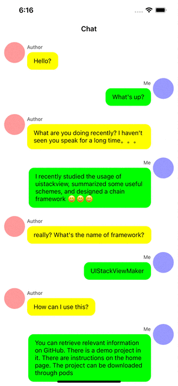

UIStackViewMaker

----------------

快速构造UIStackView实例的API.

#### 多语言翻译

[英文 README](README.md)

#### 主要特性

* 链式编程接口
* 修改UIStackView属性很方便
* 快速重载或添加排列视图
* 支持反向排列视图

#### 要求

* iOS 9.0+
* macOS 10.11+

#### 效果展示



#### 安装教程

##### CocoaPods

推荐使用CocoaPods来进行安装，只需添加如下语句到你的Podfile文件中:

```ruby
pod 'UIStackViewMaker'
```

##### 手动安装

将UIStackViewMaker文件夹拖入工程中直接使用

#### 入门指南

```objective-c
#import <UIStackViewMaker/UIStackView+STMaker.h>

...

UIStackView * contentStackView = [UIStackView.stMake stConfig:^(STStackViewConfig * _Nonnull config) {
    config.stVer.stDistributeFill.stAlignLead.stInsets(UIEdgeInsetsMake(5, 0, 0, 0));
}];
[contentStackView stGroupItems:^(STStackItemMaker * _Nonnull make) {
    make.stView(self.nameLabel).stTrailSpacing(5);
    make.stView(self.messageLabel);
}];
```

#### 证书

`UIStackViewMaker` 遵循 [MIT-licensed](https://raw.githubusercontent.com/zxinsunshine/UIStackViewMaker/main/LICENSE).

